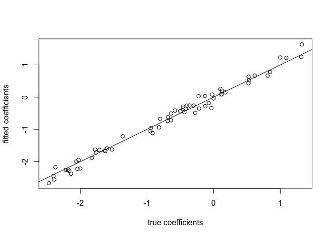

<!-- README.md is generated from README.Rmd. Please edit that file -->

# multisdm

[](https://lifecycle.r-lib.org/articles/stages.html#experimental)
<!-- badges: start --> <!-- badges: end -->

This repository implements a multispecies (point process) SDM for
presence/absence and presence-only data (assuming proportional bias in
presence-only data between species), in
[greta](https://greta-stats.org), following the definition in [Fithian
et al. (2014)](https://doi.org/10.1111/2041-210X.12242) and the
[multispeciespp](https://github.com/wfithian/multispeciesPP) R package.

It demonstrates how to set up the likelihood structure for such a model
in greta, in a way that then makes it easy to replace the models of
species distribution with something more complex than a linear model.
Note that for adding spatial random effects to the species abundances,
packages like
[PointedSDMs](https://cran.r-project.org/package=PointedSDMs) exist and
will be faster and easier to use.

### Example code from multispeciesPP

``` r
# remotes::install_github("wfithian/multispeciespp")
library(multispeciesPP)

n.pixel <- 1000
n.other.spec <- 20
spec.names <- letters[1:(n.other.spec+1)]

## Geographic covariates affecting species abundance
x <- matrix(rnorm(2*n.pixel),nrow=n.pixel)

## Geographic covariate causing selection bias (correlated with x1)
z <- scale(x[,1] + rnorm(n.pixel)*sqrt(.95^(-2)-1))

## Intercept and slopes for abundance rate
alpha <- c(-2,.3*rnorm(n.other.spec)-2)
beta <- cbind(c(1,-.5),matrix(rnorm(n.other.spec*2)/2,2))

## Intercept and slope for selection bias
gamma <- -4
delta <- -.3

## PO data is impacted by selection bias
po.count <- matrix(rpois(n.pixel*(n.other.spec+1),lambda=exp(rep(alpha,each=n.pixel) + x %*% beta + gamma + c(z) * delta)),
                   n.pixel,dimnames=list(NULL,spec.names))

PO.list <- lapply(spec.names,function(sp) data.frame(x1=x[,1],x2=x[,2],z=z)[rep(1:n.pixel,po.count[,sp]),])
names(PO.list) <- spec.names
BG <- data.frame(x1=x[1,],x2=x[,2],z=z)

## PA data is unbiased
n.sites <- 500
pa.samp <- sample(1:n.pixel,n.sites)
pa.count <- matrix(rpois(n.sites*(n.other.spec+1),lambda=exp(rep(alpha,each=n.sites) + x[pa.samp,] %*% beta)),
                   n.sites,dimnames=list(NULL,spec.names))
table(pa.count>0)
#> 
#> FALSE  TRUE 
#>  8754  1746

## PA data doesn't need biasing covariates

PA <- cbind(data.frame(x1=x[pa.samp,1],x2=x[pa.samp,2]),as.data.frame(1*(pa.count>0)))

full.mod <- multispeciesPP(~x1+x2,~z,PA,PO.list,BG,region.size=n.pixel)

summary(full.mod)
#>                         Length Class   Mode   
#> sdm.formula                 2  formula call   
#> bias.formula                2  formula call   
#> normalized.species.coef    84  -none-  numeric
#> normalized.bias.coef        1  -none-  numeric
#> normalized.all.coef        85  -none-  numeric
#> normalized.std.errs        85  -none-  numeric
#> all.coef                   85  -none-  numeric
#> std.errs                   85  -none-  numeric
#> species.coef               84  -none-  numeric
#> bias.coef                   1  -none-  numeric
#> linear.fit.PA           10500  -none-  numeric
#> fit.PA                  10500  -none-  numeric
#> linear.bias.fit.BG      21000  -none-  numeric
#> bias.fit.BG             21000  -none-  numeric
#> linear.fit.BG           21000  -none-  numeric
#> fit.BG                  21000  -none-  numeric

plot(c(rbind(alpha,beta)),c(full.mod$species.coef[1:3,]),
     xlab="true coefficients",ylab="fitted coefficients")

abline(0,1)
```

<!-- -->
