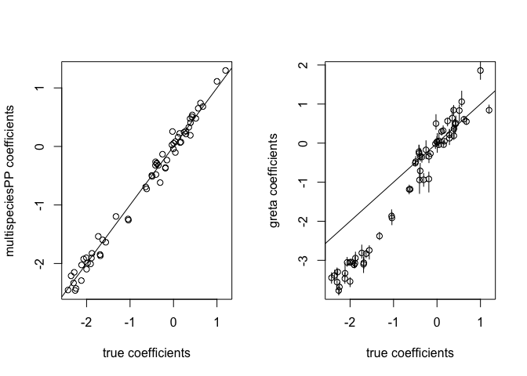

<!-- README.md is generated from README.Rmd. Please edit that file -->

# multisdm

[](https://lifecycle.r-lib.org/articles/stages.html#experimental)
<!-- badges: start --> <!-- badges: end -->

This repository implements a multispecies (point process) SDM for
presence/absence and presence-only data (assuming proportional bias in
presence-only data between species), in
[greta](https://greta-stats.org), following the definition in [Fithian
et al. (2014)](https://doi.org/10.1111/2041-210X.12242) and the
[multispeciespp](https://github.com/wfithian/multispeciesPP) R package.

It demonstrates how to set up the likelihood structure for such a model
in greta, in a way that then makes it easy to replace the models of
species distribution with something more complex than a linear model.
Note that for adding spatial random effects to the species abundances,
packages like
[PointedSDMs](https://cran.r-project.org/package=PointedSDMs) exist and
will be faster and easier to use.

### Package installation

``` r
remotes::install_github("wfithian/multispeciespp")
install.packages("greta")
```

### Example data

Using code from `?multispeciesPP::multispeciesPP`:

``` r
n.pixel <- 1000
n.other.spec <- 20
spec.names <- letters[1:(n.other.spec+1)]

## Geographic covariates affecting species abundance
x <- matrix(rnorm(2*n.pixel),nrow=n.pixel)

## Geographic covariate causing selection bias (correlated with x1)
z <- scale(x[,1] + rnorm(n.pixel)*sqrt(.95^(-2)-1))

## Intercept and slopes for abundance rate
alpha <- c(-2,.3*rnorm(n.other.spec)-2)
beta <- cbind(c(1,-.5),matrix(rnorm(n.other.spec*2)/2,2))

## Intercept and slope for selection bias
gamma <- -4
delta <- -.3

## PO data is impacted by selection bias
po.count <- matrix(rpois(n.pixel*(n.other.spec+1),lambda=exp(rep(alpha,each=n.pixel) + x %*% beta + gamma + c(z) * delta)),
                   n.pixel,dimnames=list(NULL,spec.names))

PO.list <- lapply(spec.names,function(sp) data.frame(x1=x[,1],x2=x[,2],z=z)[rep(1:n.pixel,po.count[,sp]),])
names(PO.list) <- spec.names
BG <- data.frame(x1=x[1,],x2=x[,2],z=z)

## PA data is unbiased
n.sites <- 500
pa.samp <- sample(1:n.pixel,n.sites)
pa.count <- matrix(rpois(n.sites*(n.other.spec+1),lambda=exp(rep(alpha,each=n.sites) + x[pa.samp,] %*% beta)),
                   n.sites,dimnames=list(NULL,spec.names))

## PA data doesn't need biasing covariates
PA <- cbind(data.frame(x1=x[pa.samp,1],x2=x[pa.samp,2]),as.data.frame(1*(pa.count>0)))

# combine and record true parameters
true_parameters <- list(
  alpha = alpha,
  beta = beta,
  gamma = gamma,
  delta = delta
)
```

### Fitting in multispeciesPP

``` r
library(multispeciesPP)

full.mod <- multispeciesPP(sdm.formula = ~x1 + x2,
                           bias.formula = ~z,
                           PA = PA,
                           PO = PO.list,
                           BG = BG,
                           region.size=n.pixel)
```

### Fitting in greta

The model formulation (adapted from equations in Fithian et al. 2014) is
as follows.

Poisson sampling model for abundance data (counts $Y_{i,k}^{a}$ of
species $k$ at location $i$ with area/effort $A_i$):

$Y_{i,k}^{a} \sim Poisson(\lambda_{i,k} A_i)$

Complementary log-log & Bernoulli sampling model for presence-absence
data (binary dummy presence values $Y_{i,k}^{pa}$):

$Y_{i,k}^{pa} \sim Bernoulli(p_{i,k})$
$p_{i,k} = 1 - exp(-\lambda_{i,k}A_i)$

Poisson point process sampling model for presence-only data (here
considered as the number of points $Y_{i,k}^{po}$ in region i):

$Y_{i,k}^{po} \sim Poisson(\lambda_{i,k} b_{i,k} A_i)$

Log-linear model for the abundance of species $k$ at site $i$:

$log(\lambda_{i,k}) = \mathbf{\alpha}_k + \mathbf{\beta}_k' \mathbf{X}_i$

Log-linear model for the bias/thinning rate of species $k$ at site $i$
(assumed proportional across all species):

$log(b_{i,k}) = \mathbf{\gamma}_k + \delta' \mathbf{Z}_i$

where the following are parameters: $\mathbf{\alpha}_k$ and
$\mathbf{\beta}_k$, the intercept and vector of regression coefficients
for the abundance of species $k$, and $\mathbf{\gamma}_k$ and $\delta$
the intercept (for each species $k$) and vector of regression
coefficients (common across all species) for the bias/thinning process.

``` r
library(greta)
#> 
#> Attaching package: 'greta'
#> The following objects are masked from 'package:stats':
#> 
#>     binomial, cov2cor, poisson
#> The following objects are masked from 'package:base':
#> 
#>     %*%, apply, backsolve, beta, chol2inv, colMeans, colSums, diag,
#>     eigen, forwardsolve, gamma, identity, rowMeans, rowSums, sweep,
#>     tapply

# numbers of covariates in use
n_cov_abund <- ncol(x)
n_cov_bias <- ncol(z)

# number of species to model
n_species <- n.other.spec + 1

# tidy up PA data
pa <- 1 * (pa.count > 0)

# define parameters with normal priors, matching the ridge regression setup in
# multispeciesPP defaults
penalty.l2.sdm <- penalty.l2.bias <- 0.1
penalty.l2.intercept <- 1e-4

intercept_sd <- 1 / penalty.l2.intercept
beta_sd <- 1 / penalty.l2.sdm
delta_sd <- 1 / penalty.l2.bias

# intercept and shared slope for selection bias
gamma <- normal(0, intercept_sd, dim = n_species)
#> ℹ Initialising python and checking dependencies, this may take a moment.
#> ✔ Initialising python and checking dependencies ... done!               
delta <- normal(0, delta_sd, dim = c(n_cov_bias))

# intercept and slopes for abundance rate
alpha <- normal(0, intercept_sd, dim = n_species)
beta <- normal(0, beta_sd, dim = c(n_cov_abund, n_species))

# log rates across all sites
log_lambda <- sweep(x %*% beta, 2, alpha, FUN = "+")
# can easily replace this model with something more interesting, like a low-rank GP on covariate space or something mechanistic

# (get outer product of vector of shared bias across pixels and vector of intercepts across species)
log_bias <- (z %*% delta) %*% t(gamma)

# rates across all sites and species
lambda <- exp(log_lambda)
bias <- exp(log_bias)

# define likelihoods

# compute probability of presence (and detection) at the PA sites, assuming area/effort of 1 in all these sites, for identifiability
area_pa <- 1
p <- icloglog(log_lambda[pa.samp, ] + log(area_pa))
distribution(pa) <- bernoulli(p)

# compute (biased) expected numbers of presence-only observations across all presence and background sites, assuming presence-only count aggregation area of 1 (as in multispeciesPP definition). Not that when these are all the same, this value only changes all the gamma parameters by a fixed amount, and these are not the parameters of interest
area_po <- 1
# combine on log scale, for less risk of numerical overflow (in greta likelihood)
po_rate <- exp(log_lambda + log_bias + log(area_po))
distribution(po.count) <- poisson(po_rate)

# deifne and fit the model
m <- model(alpha, beta, gamma, delta)
draws <- mcmc(m)
#> running 4 chains simultaneously on up to 8 CPU cores
#>     warmup                                           0/1000 | eta:  ?s              warmup ==                                       50/1000 | eta: 49s | 12% bad    warmup ====                                    100/1000 | eta: 38s | 11% bad    warmup ======                                  150/1000 | eta: 33s | 31% bad    warmup ========                                200/1000 | eta: 31s | 36% bad    warmup ==========                              250/1000 | eta: 28s | 42% bad    warmup ===========                             300/1000 | eta: 26s | 44% bad    warmup =============                           350/1000 | eta: 24s | 48% bad    warmup ===============                         400/1000 | eta: 22s | 49% bad    warmup =================                       450/1000 | eta: 20s | 48% bad    warmup ===================                     500/1000 | eta: 18s | 44% bad    warmup =====================                   550/1000 | eta: 17s | 40% bad    warmup =======================                 600/1000 | eta: 15s | 37% bad    warmup =========================               650/1000 | eta: 13s | 35% bad    warmup ===========================             700/1000 | eta: 11s | 32% bad    warmup ============================            750/1000 | eta:  9s | 31% bad    warmup ==============================          800/1000 | eta:  7s | 29% bad    warmup ================================        850/1000 | eta:  5s | 28% bad    warmup ==================================      900/1000 | eta:  4s | 26% bad    warmup ====================================    950/1000 | eta:  2s | 25% bad    warmup ====================================== 1000/1000 | eta:  0s | 24% bad
#>   sampling                                           0/1000 | eta:  ?s            sampling ==                                       50/1000 | eta: 46s | 99% bad  sampling ====                                    100/1000 | eta: 37s | 96% bad  sampling ======                                  150/1000 | eta: 38s | 97% bad  sampling ========                                200/1000 | eta: 34s | 97% bad  sampling ==========                              250/1000 | eta: 33s | 97% bad  sampling ===========                             300/1000 | eta: 30s | 97% bad  sampling =============                           350/1000 | eta: 26s | 94% bad  sampling ===============                         400/1000 | eta: 26s | 95% bad  sampling =================                       450/1000 | eta: 24s | 96% bad  sampling ===================                     500/1000 | eta: 23s | 96% bad  sampling =====================                   550/1000 | eta: 20s | 95% bad  sampling =======================                 600/1000 | eta: 17s | 94% bad  sampling =========================               650/1000 | eta: 15s | 93% bad  sampling ===========================             700/1000 | eta: 12s | 92% bad  sampling ============================            750/1000 | eta: 10s | 93% bad  sampling ==============================          800/1000 | eta:  8s | 93% bad  sampling ================================        850/1000 | eta:  6s | 93% bad  sampling ==================================      900/1000 | eta:  4s | 94% bad  sampling ====================================    950/1000 | eta:  2s | 94% bad  sampling ====================================== 1000/1000 | eta:  0s | 94% bad
```

check greta has converged for all parameters

``` r
r_hats <- coda::gelman.diag(draws, autoburnin = FALSE, multivariate = FALSE)
max(r_hats$psrf[, 2])
#> [1] 1190.426
```

### Visualising parameter estimates

``` r
# true abundance parameters as a vector
truth <- rbind(true_parameters$alpha, true_parameters$beta)

# multispeciesPP estimates
multispeciesPP_estimates <- c(full.mod$species.coef[1:3,])

# greta estimates and uncertainty
greta_sims <- calculate(rbind(t(alpha), beta),
                             values = draws,
                             nsim = 1000)[[1]]
greta_estimates <- c(apply(greta_sims, 2:3, mean))
greta_upper <- c(apply(greta_sims, 2:3, quantile, 0.975))
greta_lower <- c(apply(greta_sims, 2:3, quantile, 0.025))

par(mfrow = c(1, 2))
plot(truth, multispeciesPP_estimates,
     xlab = "true coefficients",
     ylab = "multispeciesPP coefficients")
abline(0,1)

plot(truth, greta_estimates,
     xlab = "true coefficients",
     ylab = "greta coefficients")
arrows(x0 = truth,
       x1 = truth,
       y0 = greta_lower,
       y1 = greta_upper,
       length = 0)
abline(0,1)
```

<!-- -->

``` r
# add error bars
```
